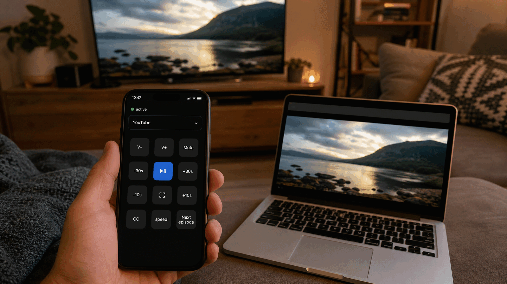
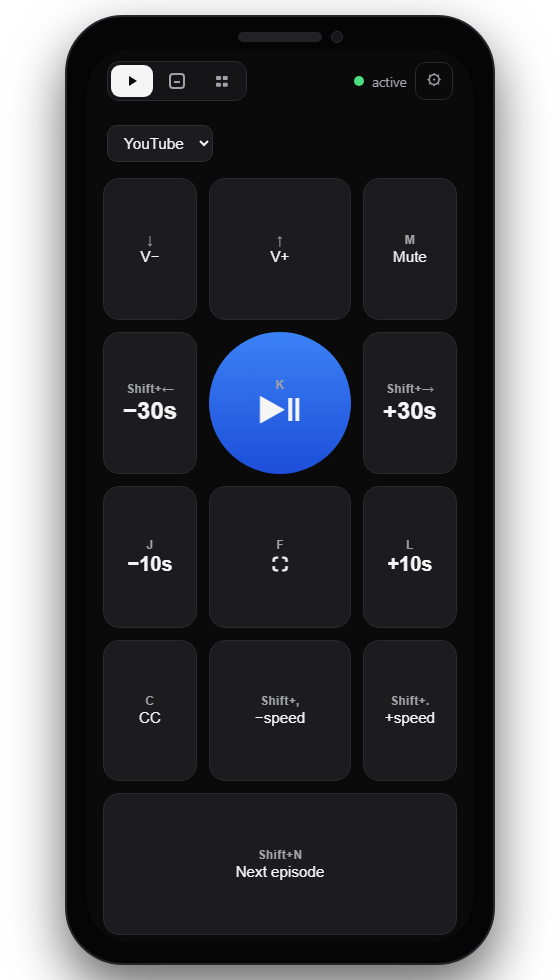
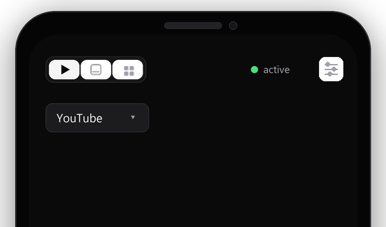
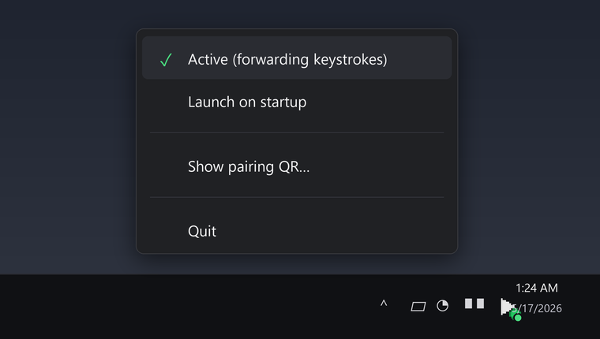

<div align="center">


<h1>Sofamote</h1>

<p><em>Your phone, your remote, any streaming site.</em></p>

[](LICENSE)
[](https://github.com/oudajosefu/sofamote/releases/latest)
[](https://github.com/oudajosefu/sofamote/actions/workflows/ci.yml)
[](#-install)

<br />

[](https://github.com/oudajosefu/sofamote/releases/latest)

</div>

<br />

<p align="center">
  
</p>

## Why Sofamote?

Laptop closed, HDMI to the TV, comfy on the sofa — and the only way to pause is to walk over and reopen the lid. Sofamote turns your phone into a real remote for the video that's currently focused on your laptop. It runs locally on your WiFi, speaks the browser's native keyboard shortcuts (so it works on **Netflix, YouTube, Disney+, HBO, anything**), and never touches the cloud.

## ✨ Features

<table>
<tr>
<td valign="top" width="60%">

- 🌐 **Works on every streaming site** — Sofamote sends native keystrokes to the focused browser window, so there are no DRM issues and no per-site integrations to break.
- ⚡ **Per-site profiles** — built-in mappings for YouTube, Netflix, and a generic fallback. `k` for YouTube play/pause, `space` for Netflix — Sofamote routes to the right key for you.
- 🔒 **LAN-only, no cloud** — your phone talks to your laptop over your own WiFi. No accounts, no telemetry, no third-party server.
- 📱 **Installs like a real app** — the phone client is a PWA. Pair once via QR, add to home screen, and it launches in one tap.
- 🟢 **Tray arm/disarm** — flip a tray toggle to stop forwarding keystrokes (so stray taps don't pause your movie mid-scene) without disconnecting the phone.
- 🪟 **Cross-platform installers** — Windows `.msi`/`.exe`, macOS `.dmg`, Linux `.deb`, built by GitHub Actions on every release, with signing support wired up for future releases.

</td>
<td valign="top" width="40%" align="center">



</td>
</tr>
</table>

## 📦 Install

Download the asset for your OS from the [latest release](https://github.com/oudajosefu/sofamote/releases/latest).

> **macOS/Linux testing note:** macOS and Linux release artifacts are built by CI, but have not yet been personally tested by the maintainer. If you try one, you are very welcome to open an issue or PR with your OS/version and how the install/run experience went.
>
> **Signing note:** Windows and macOS releases are not signed/notarized yet. The release workflow is set up to support signing in the future once the required certificates and credentials are configured.

### Windows

1. Run the `.msi` installer (or the portable `sofamote.exe` if you'd rather not install).
2. When Windows Firewall prompts, allow access on **private networks only**.
3. Sofamote opens the pairing QR in your browser on first launch — scan it from your phone.

> Most users want the `.msi`. The portable `.exe` works too, but **Launch on startup** stores its current path, so moving the file later will break startup.
>
> **Lid-closed setup:** in Windows **Power Options → Choose what closing the lid does**, set the plugged-in profile to **Do nothing**, and raise (or disable) the sign-in screen-lock timeout — keystrokes won't reach a locked session.

### macOS

1. Open the `.dmg` and drag `Sofamote.app` into `/Applications`.
2. Launch Sofamote from Applications.
3. Scan the QR code from the menu bar → **Show pairing QR…** (or the browser tab it opens on first launch).

Current DMGs are not notarized yet, so macOS may show Gatekeeper warnings. The release workflow is prepared for notarization once signing credentials are configured.

### Linux

1. Download the latest `.deb` release artifact from the [releases page](https://github.com/oudajosefu/sofamote/releases/latest).
2. In a terminal, go to the directory where the `.deb` was downloaded and install it:

```bash
cd ~/Downloads
sudo apt install ./sofamote_*.deb
sofamote
```

The published `.deb` targets Debian/Ubuntu-style systems.

## 🔗 Pairing in 10 seconds

<table>
<tr>
<td valign="top" width="33%" align="center">
<br />
<b>1. Scan the QR</b><br />
Sofamote opens the QR in your browser on first launch — or right-click the tray icon → <b>Show pairing QR…</b>.
</td>
<td valign="top" width="33%" align="center">
<br />
<b>2. Open the PWA</b><br />
Your phone loads the remote, stores the pairing token, and offers an <b>Add to home screen</b> prompt.
</td>
<td valign="top" width="33%" align="center">
<br />
<b>3. Green dot = ready</b><br />
Click into a video on the laptop, and start tapping. The status dot stays green while forwarding is active.
</td>
</tr>
</table>

## 🎛 Controls

Override the defaults per site via the profile dropdown.

| Button       | Default   | YouTube profile       | Netflix profile |
| ------------ | --------- | --------------------- | --------------- |
| Play / Pause | `space`   | `k`                   | `space`         |
| −10s / +10s  | `←` / `→` | `j` / `l`             | `←` / `→`       |
| −30s / +30s  | 3×arrow   | `shift+←` / `shift+→` | 3×arrow         |
| Volume       | `↑` / `↓` | `↑` / `↓`             | `↑` / `↓`       |
| Mute         | `m`       | `m`                   | `m`             |
| Fullscreen   | `f`       | `f`                   | `f`             |
| Captions     | `c`       | `c`                   | `c`             |
| Next episode | —         | `shift+n`             | `shift+n`       |
| Speed −/+    | —         | `shift+,` / `shift+.` | —               |

## 🟢 System tray

<table>
<tr>
<td valign="top">

Sofamote lives in the tray so it can run quietly in the background.

- **Active (forwarding keystrokes)** — arm/disarm. When unchecked, the phone stays connected but taps are ack'd as `suppressed` and no keystrokes are sent. The PWA dot turns amber.
- **Launch on startup** — registers Sofamote to start hidden in the tray when you log in.
- **Show pairing QR…** — opens `/qr.png` so you can re-pair a phone or add a second one.
- **Quit** — gracefully stops the server.

Launching Sofamote again while it's already running just shows an "already running" notice — no duplicate tray icons.

</td>
<td valign="top" width="40%" align="center">

</td>
</tr>
</table>

## 🔒 Security

Sofamote generates a 128-bit random token on first launch and persists it to `%APPDATA%/sofamote/config.json` (Windows) or `~/.config/sofamote/config.json` (Linux/macOS). Every WebSocket upgrade must present the same token (checked in constant time) or the connection is rejected with HTTP 401. The token is embedded in the QR URL — anyone who can see the QR can pair.

To reset pairing (e.g. your phone was lost), delete the config file and restart the server. All previously paired devices stop working.

---

<details>
<summary><b>🛠 Development setup</b></summary>

### Prerequisites

- Git
- Rust toolchain (`rustup`) with `cargo` on PATH
- Node.js 20 with npm
- Phone on the same WiFi network as the development machine

On Ubuntu/Debian, install the desktop dependencies used by the tray icon and keyboard automation layers before building the server:

```bash
sudo apt-get update
sudo apt-get install -y \
  libgtk-3-dev \
  libayatana-appindicator3-dev \
  libxdo-dev \
  libxcb-shape0-dev \
  libxcb-xfixes0-dev
```

### Clone and install

```bash
git clone https://github.com/oudajosefu/sofamote.git
cd sofamote
npm install
```

### Run in development

Start the Rust server and the Vite dev client in separate terminals:

```bash
npm run dev:server
npm run dev:client
```

Useful commands:

```bash
npm run build
npm start
```

`npm run dev:server` runs the Rust server in debug mode. On Windows, debug runs print the pairing QR in the console. Release-mode Windows builds run as a tray app with no console window and open the pairing QR in the browser once on first launch.

### Build distributable packages locally

Install the platform-specific Cargo packaging tool first:

```bash
cargo install cargo-wix      # Windows
cargo install cargo-bundle   # macOS
cargo install cargo-deb      # Linux
```

Then use the matching package script:

```bash
npm run package:win
npm run package:mac
npm run package:linux
```

### Layout

```
server/   Rust binary. HTTP + WebSocket + keystroke simulation.
client/   Vite + React PWA. Served from the laptop, installs to phone.
```

</details>

<details>
<summary><b>🚀 Releases</b></summary>

The repo is licensed under the MIT License. The root [LICENSE](LICENSE) file is the canonical license text, and the Windows MSI displays the same MIT terms during installation.

Current Windows and macOS releases are not signed/notarized yet. The GitHub Actions release workflow is set up to sign Windows `sofamote.exe`/MSI artifacts and notarize macOS DMGs once the required credentials are configured. That will improve the publisher/trust experience, though brand-new Windows releases can still need time to build Microsoft SmartScreen reputation.

### Cutting a new version

Use the root release command from a **clean `main` checkout** with an `origin` remote configured:

```bash
npm run release -- patch
npm run release -- minor --dry-run
npm run release -- 0.3.1
```

It verifies every repo-owned version reference is in sync, updates them together, runs `npm run build`, creates a `chore(release): vX.Y.Z` commit, and pushes a lightweight `vX.Y.Z` tag. [`.github/workflows/release.yml`](.github/workflows/release.yml) listens for `v*` tags and builds + publishes all three platform artifacts.

</details>

<details>
<summary><b>✅ Verifying end-to-end</b></summary>

1. On Windows, launch the installed app, the downloaded `sofamote.exe`, or a local `target\release\sofamote.exe` build and confirm no console window appears, the tray icon appears, and the first release launch opens the pairing QR in the browser once. For console-first debugging, run `npm run dev:server` and confirm it prints the QR and logs `Listening on http://<LAN-IP>:7337`.
2. Launch Sofamote again while it is already running. Confirm it shows an "already running" notice and does not create a second tray or menu bar icon.
3. Right-click the tray icon → **Active** to toggle forwarding on. The icon should show a green dot overlay.
4. Open a streaming site on the laptop, start a video, click into the player so it has focus.
5. Scan the QR from your phone. The PWA should load, the status dot should turn green, and the layout should say "active".
6. Tap **Play/Pause** — video pauses. Tap **+10s** — video scrubs.
7. Right-click the tray icon → uncheck **Active**. The PWA dot should turn amber with a "paused" banner; taps should no longer move the video.
8. Right-click the tray icon → check **Launch on startup**, reboot, and confirm the server comes up automatically in the tray with no console window on Windows.
9. Switch profile to **YouTube** on a YouTube tab; confirm `k` is used instead of `space`.
10. Close the lid. Confirm the remote still controls playback.
11. Toggle phone airplane mode briefly; PWA should auto-reconnect.

</details>

---

<div align="center">

Made with ☕ and a TV remote that kept getting lost. [MIT License](LICENSE).

</div>
